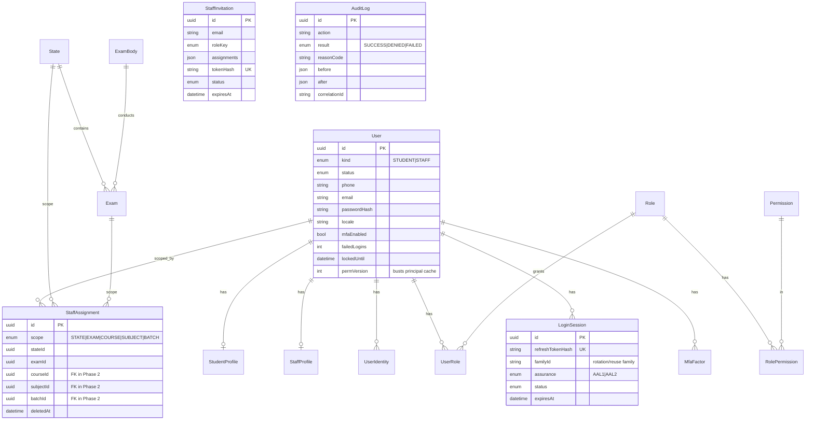

# ER Diagram — Phase 1

Standalone / cross-cutting entities: `OtpChallenge`, `AuditLog` (append-only), `ExamBody`.
Later phases attach Course/Batch/Subject/Chapter/Topic/Lesson, questions/tests/attempts, orders/
payments/entitlements, doubts, notifications, and support to this core.
